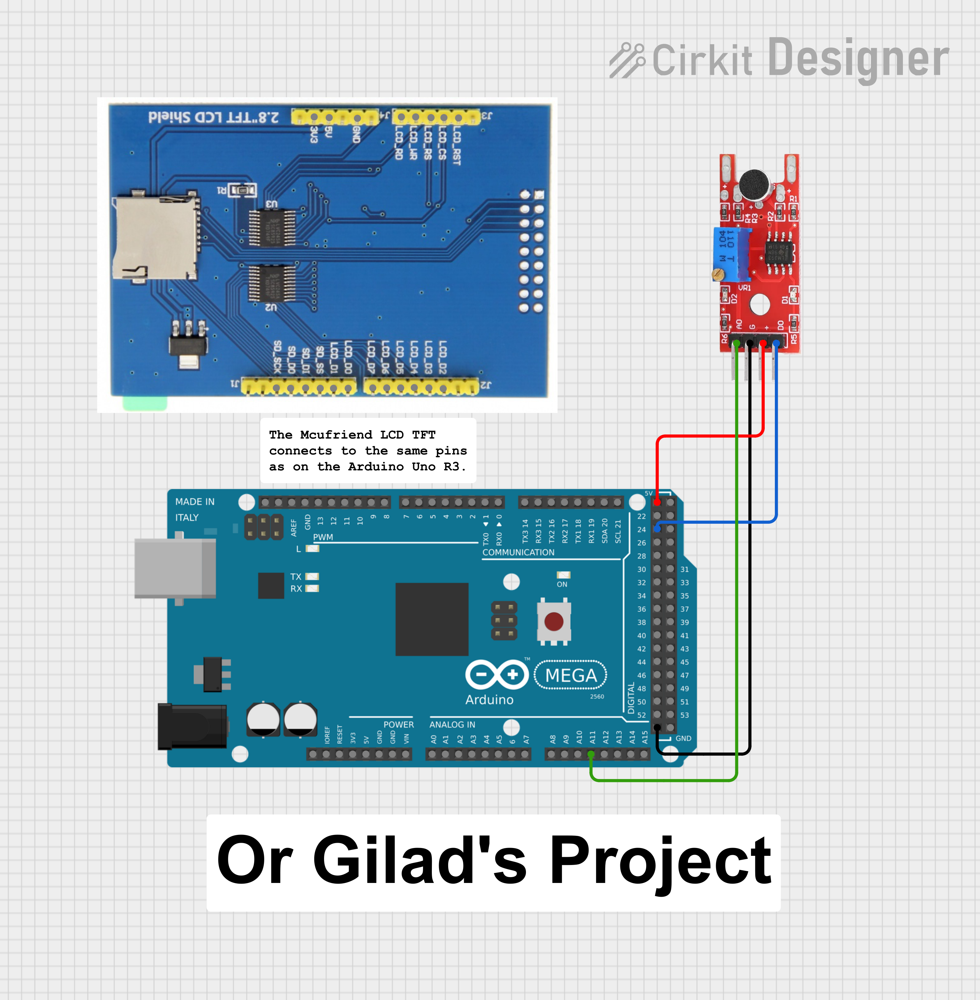

# Arduino Mega 2560 Sound Meter

A smooth, real-time **sound level meter** for **Arduino Mega 2560** using the **KY-038 microphone sensor module** and a **2.8" MCUFRIEND TFT display**.  
The project displays live dB readings, dynamic color bars, sound categories (*Quiet / Moderate / Loud*), and a microphone icon — all with **flicker-free graphics** and **robust sensor detection**.

---

## Features

- **Fast & flicker-free dB updates**
  - Uses exponential moving average (EMA) + envelope detection for stable readings.
- **Real-time sound level bar**
  - Green → Yellow → Red gradient with smooth transitions.
- **Noise category indicator**
  - Automatically labels:  
    - 🟢 **Quiet**  
    - 🟡 **Moderate**  
    - 🔴 **Loud**
- **Microphone status detection**
  - Detects and handles sensor disconnects or flatline readings.
- **Digital trigger LED (DO pin)**
  - Built-in LED flashes briefly on loud spikes.
- **Clean TFT UI**
  - Black background, white labels, cyan mic icon, and clear dividers at 0 / 20 / 40 / 60 / 80 dB.

---

## Components Used

| Component | Connection | Description |
|------------|-------------|-------------|
| **Arduino Mega 2560** | — | Main MCU |
| **KY-038 Sound Sensor** | AO → **A11** DO → **D24** (active LOW, `INPUT_PULLUP`) | Analog amplitude + digital trigger |
| **LED (optional)** | D13 | Flashes on peak detection |
| **MCUFRIEND 2.8" TFT** | Standard UNO shield pins | Visual interface |

---

## Display Layout

| Section | Description |
|----------|-------------|
| **Header** | “KY-038 Sound Meter” |
| **Big Text** | Current sound level in decibels (`dB: 42.8`) |
| **Bar Graph** | Horizontal bar (green → yellow → red) up to 80 dB |
| **Category** | "Quiet", "Moderate", or "Loud" |
| **Digital Output (DO)** | Displays trigger status (`H` / `L`) |
| **Microphone Icon** | Decorative symbol in bottom-right corner |

---

## Algorithm Highlights

- **DC offset removal** using exponential mean filter (`DC_BETA = 0.03`)
- **Envelope + RMS fusion** for accurate sound amplitude tracking
- **Noise immunity** through smoothing (`COMB_EMA_ALPHA = 0.45`)
- **Auto recovery** if sensor stalls or outputs invalid data

---

## Circuit Diagram

| Circuit Diagram | Actual Circuit |
|----------|---------------|
|  |  |

---

## Libraries Required

Install from the Arduino Library Manager:

- **MCUFRIEND_kbv**
- **Adafruit_GFX**

---

## How It Works

1. The **KY-038 sensor** outputs both analog (sound amplitude) and digital (threshold trigger) signals.  
2. The Arduino reads analog data, applies RMS + envelope smoothing, and converts it to relative decibels.  
3. The **TFT screen** shows the dB value, category, and a live bar graph.  
4. The **DO pin** triggers an LED blink and updates the on-screen `DO: H/L` state.

---

## Approximate dB Mapping

| Range (approx.) | Category | Color |
|-----------------|-----------|-------|
| 0–40 dB | Quiet | 🟢 Green |
| 40–60 dB | Moderate | 🟡 Yellow |
| 60–80 dB | Loud | 🔴 Red |
